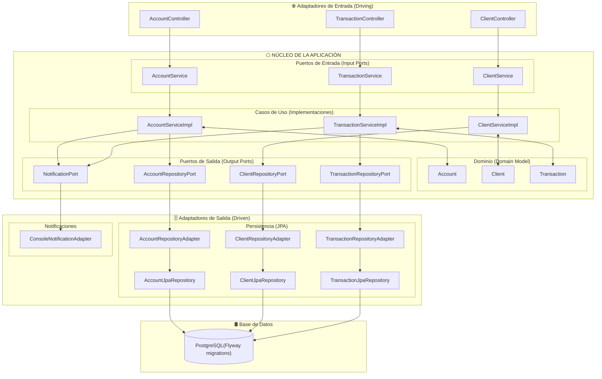

# Diagrama de Arquitectura Hexagonal

## Visión General



---

## Estructura de Paquetes

```
src/
└── main/
    └── kotlin/
        └── com/tecsup/project/hexagonal/
            │
            ├── domain/                         # DOMINIO (sin dependencias externas)
            │   └── model/                      # Entidades del negocio
            │       ├── Account.kt
            │       ├── Client.kt
            │       └── Transaction.kt
            │
            ├── application/                    # APLICACIÓN (sin dependencias externas)
            │   ├── ports/
            │   │   ├── input/                  # Casos de uso (interfaces)
            │   │   │   ├── AccountService.kt
            │   │   │   ├── ClientService.kt
            │   │   │   └── TransactionService.kt
            │   │   └── output/                 # Interfaces hacia BD y notificaciones
            │   │       ├── AccountRepositoryPort.kt
            │   │       ├── ClientRepositoryPort.kt
            │   │       ├── TransactionRepositoryPort.kt
            │   │       └── NotificationPort.kt
            │   └── usecases/                   # Implementación de la lógica de negocio
            │       ├── AccountServiceImpl.kt
            │       ├── ClientServiceImpl.kt
            │       └── TransactionServiceImpl.kt
            │
            └── infraestructure/                # INFRAESTRUCTURA
                ├── adapters/                   # Adaptadores (Patrón Adapter)
                │   ├── input/                  # Adaptadores de entrada
                │   │   └── rest/               # REST API (Spring MVC)
                │   │       ├── controller/
                │   │       │   ├── AccountController.kt
                │   │       │   ├── ClientController.kt
                │   │       │   └── TransactionController.kt
                │   │       ├── request/        # DTOs de entrada
                │   │       └── response/       # DTOs de salida
                │   └── output/                 # Adaptadores de salida
                │       ├── persistence/        # Base de Datos (JPA + Flyway)
                │       │   ├── entity/         # Entidades JPA
                │       │   ├── mapper/         # Mappers dominio ↔ entidad
                │       │   └── repository/
                │       │       ├── AccountJpaRepository.kt
                │       │       ├── AccountRepositoryAdapter.kt
                │       │       ├── ClientJpaRepository.kt
                │       │       ├── ClientRepositoryAdapter.kt
                │       │       ├── TransactionJpaRepository.kt
                │       │       └── TransactionRepositoryAdapter.kt
                │       └── notification/       # Notificaciones externas
                │           └── ConsoleNotificationAdapter.kt
                └── config/                     # Configuración (Patrón Singleton)
```
---

## Estructura de Capas

| Capa | Paquete | Responsabilidad |
|------|---------|-----------------|
| **Dominio** | `domain/model` | Entidades del negocio: `Account`, `Client`, `Transaction` |
| **Puertos de Entrada** | `application/ports/input` | Interfaces que exponen los casos de uso |
| **Casos de Uso** | `application/usecases` | Implementación de la lógica de negocio |
| **Puertos de Salida** | `application/ports/output` | Interfaces hacia infraestructura externa |
| **Adaptadores REST** | `infraestructure/adapters/input/rest` | Controllers HTTP (Spring MVC) |
| **Adaptadores Persistencia** | `infraestructure/adapters/output/persistence` | Repositorios JPA + Flyway |
| **Adaptadores Notificación** | `infraestructure/adapters/output/notification` | Notificaciones por consola |

---

## Principio de Dependencia

```
[REST Controllers]
       ↓
[Input Ports] ← implementado por → [Use Cases / Service Impl]
                                           ↓
                                   [Domain Model]
                                           ↓
                                   [Output Ports] ← implementado por → [Adapters: JPA / Notification]
                                                                               ↓
                                                                         [Base de Datos]
```

> ⚠️ **Regla clave:** Las capas internas (dominio y casos de uso) **nunca dependen** de las capas externas (infraestructura). La dependencia siempre apunta **hacia adentro**.

---
